# React Brainwave Project

This project was developed after following the video tutorial found here: [Build and Deploy a Fully Responsive Website with Modern UI/UX in React JS with Tailwind](https://www.youtube.com/watch?v=B91wc5dCEBA&t=1357s&ab_channel=JavaScriptMastery)

This video covers the essentials of developing a project with React, Tailwind CSS and Vite to create a website with the latest design elements and styling.

Below are samples of the website

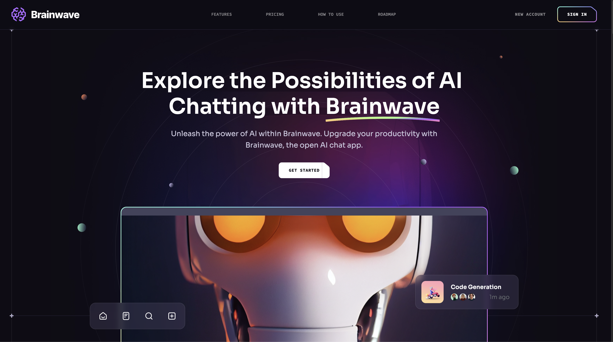
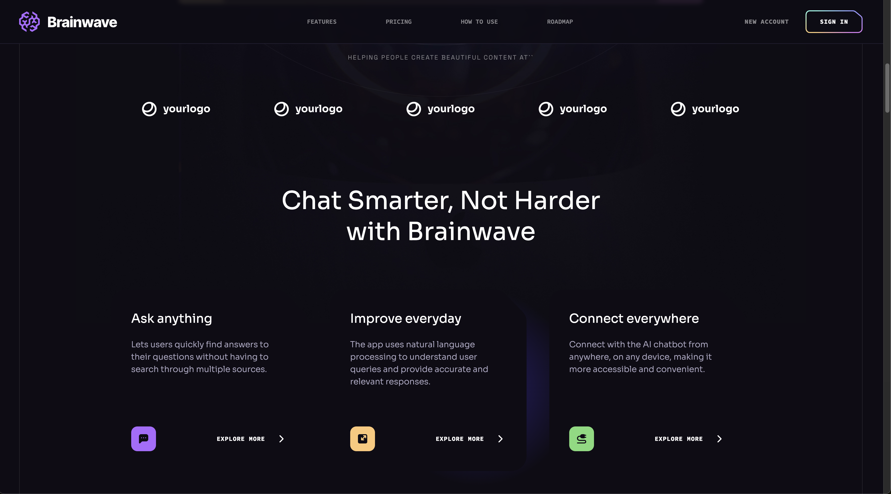
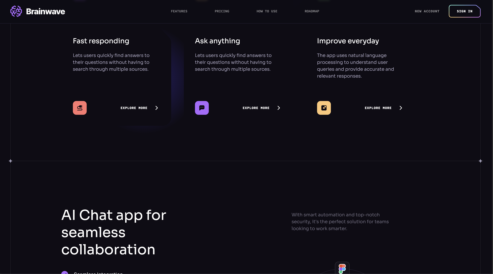
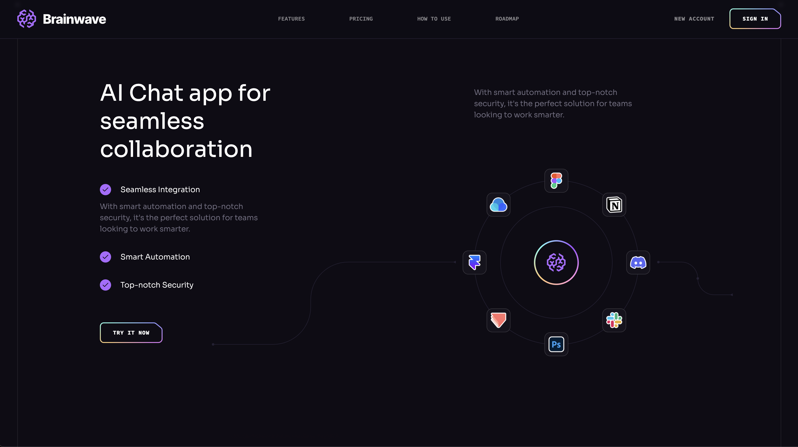
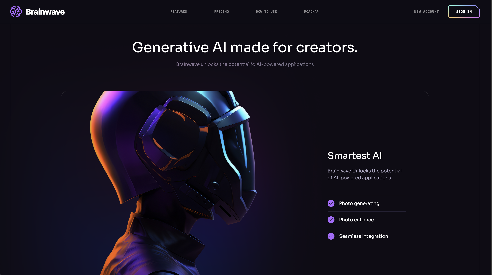
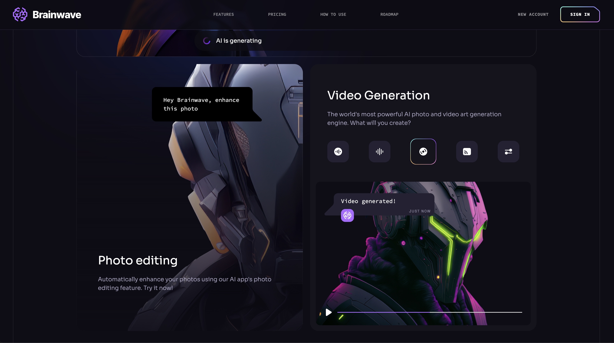
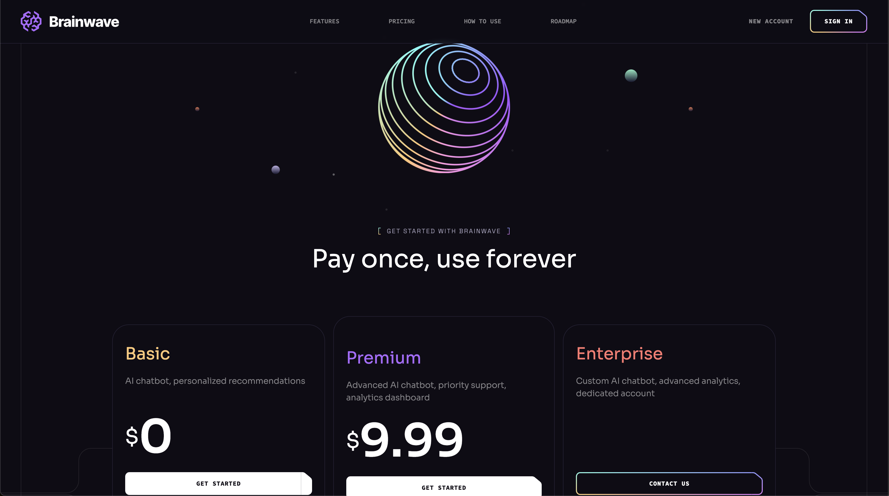
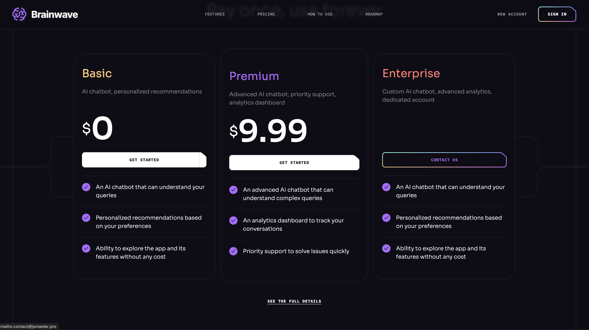
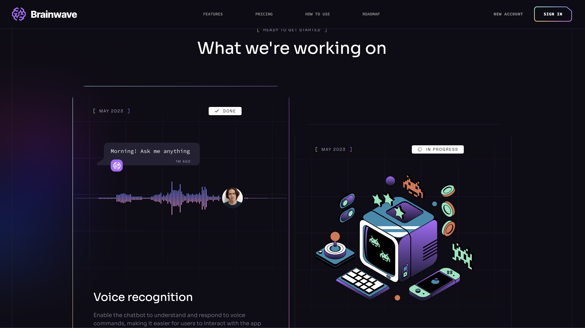
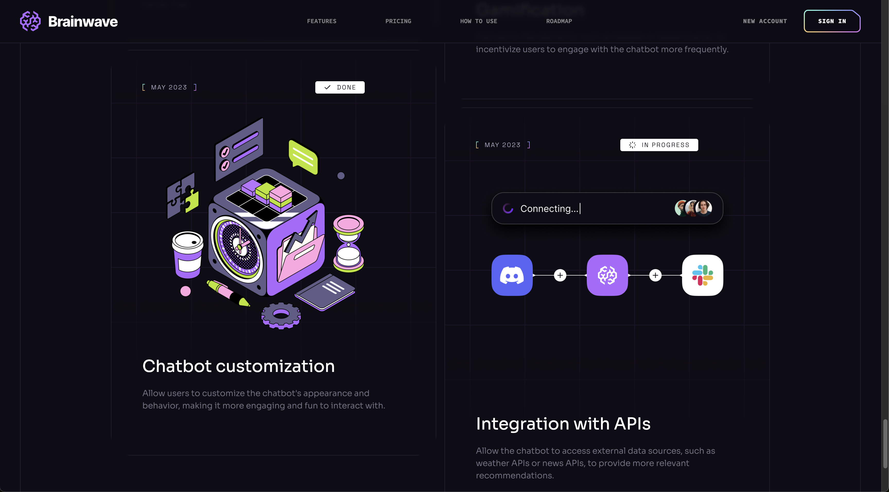
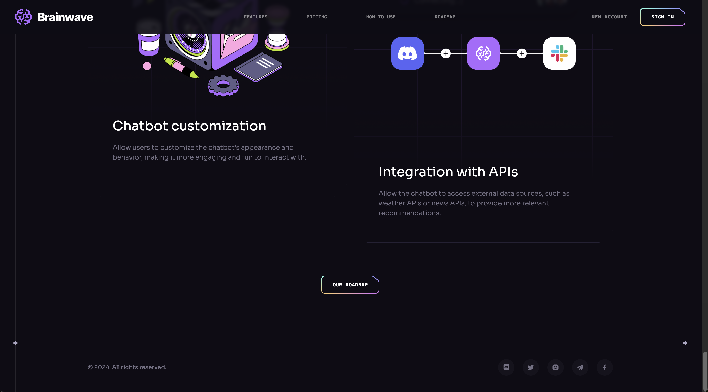

# Credit To

[Javascript Mastery](https://www.youtube.com/@javascriptmastery) - for the tutorial

# React + Vite

This template provides a minimal setup to get React working in Vite with HMR and some ESLint rules.

Currently, two official plugins are available:

- [@vitejs/plugin-react](https://github.com/vitejs/vite-plugin-react/blob/main/packages/plugin-react/README.md) uses [Babel](https://babeljs.io/) for Fast Refresh
- [@vitejs/plugin-react-swc](https://github.com/vitejs/vite-plugin-react-swc) uses [SWC](https://swc.rs/) for Fast Refresh
